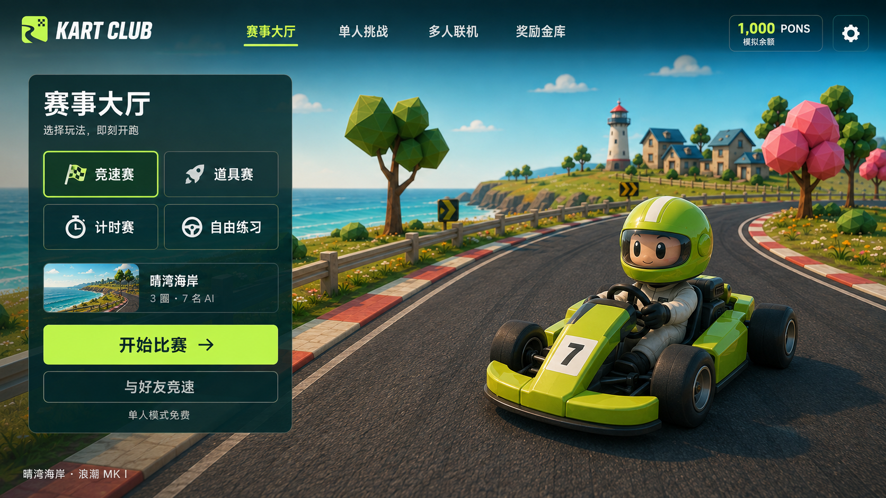
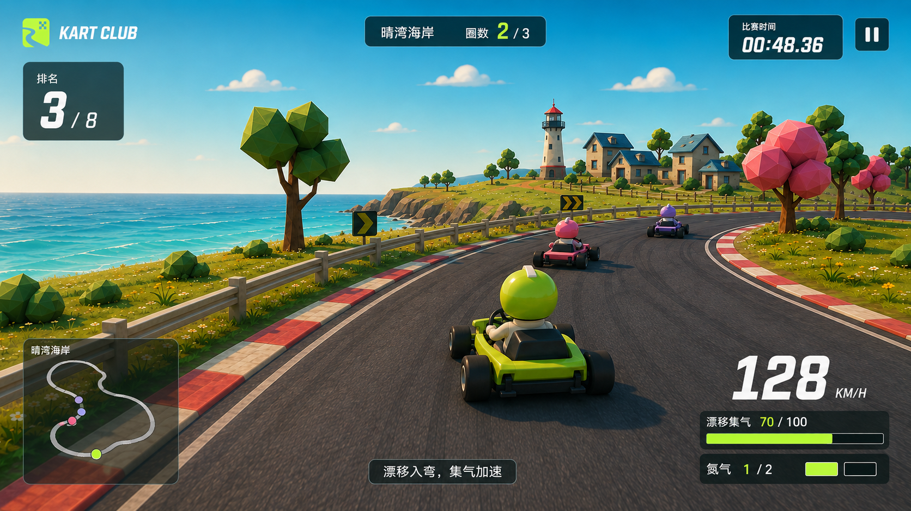

# KART CLUB 整体 UI 与场景视觉方案

日期：2026-09-07。状态：**待用户确认的设计方案，尚未进入游戏实现**。

本轮只制作方案与概念效果图，没有修改游戏代码、替换线上界面或调整游戏数据。效果图中的画面、数值与小地图用于讨论视觉目标，不代表当前游戏实机效果。

## 1. 推荐方向

采用「明亮海岸场景 + 克制的比赛界面」：保留参考图的蓝天、青蓝海水、温暖阳光、低多边形植被、灯塔村落、柏油路和红白路肩。赛车和赛道成为视觉主体，菜单与数据围绕玩家当前任务组织。

参考图几乎没有完整菜单和比赛 HUD，因此它提供的是场景、材质、光照与镜头方向。下面的界面布局是基于现有游戏功能提出的设计，不是参考图中已经存在的界面。

保留此前确认的 **KART CLUB** 名称，以及当前带道路和棋盘镂空的 Logo。Logo、选中状态、主要按钮使用现有字体绿色 **#C0FA67**。参考图中较旧的深绿白格 Logo 不作为本次品牌变更依据。

## 2. 当前差距与对应处理

判断依据：本轮查看了当前大厅界面，并阅读了 `client/main.ts`、`client/style.css`、`client/world.ts`、内容配置和现有赛道/模式定义。本轮没有进行新的驾驶或性能测试。

| 当前差距 | 设计处理 | 需要改动的层面 |
| --- | --- | --- |
| 大厅以高空俯视展示整块赛道，车辆较难成为视觉焦点 | 大厅采用海岸赛道上的展示镜头，让赛车、人物与海景形成清晰层次 | 3D 镜头与场景构图 |
| 现有场景以简化几何和大面积纯色材质为主，与参考图的道路、海岸细节差距较大 | 增加路面材质、岸线、沿海道路地标、接触阴影和植被层次 | 3D 资产、材质与灯光 |
| 大厅大标题占用较多空间，玩法设置在后续界面展开 | 首屏呈现玩法、当前赛道与开始按钮；高级设置按需展开 | 页面信息组织 |
| 现有 HUD 包含品牌、排名、时间、圈数、地图、集气、车速、按键及状态提示 | 按重要程度分区；关键驾驶区域保持清楚，次要提示收敛 | HUD 布局与交互状态 |
| 生涯、联机与奖励页面承载不同任务 | 统一基础控件，每页保留自己的任务重点 | 全局界面规范 |

## 3. 两张效果图的含义

### A：赛事大厅

- 右侧是海岸赛道与赛车展示；左侧是紧凑的比赛配置和开始操作。
- 顶部保留赛事大厅、单人挑战、多人联机、奖励金库和设置入口。
- 左侧展示现有四种玩法：竞速赛、道具赛、计时挑战、自由练习。
- 当前赛道、圈数和 AI 数量可被直接理解；更完整的难度/地图设置由对应选择界面承接。
- 「开始比赛」为主操作，「与好友竞速」为次操作。奖励信息保留入口，模拟余额明确标识。
- 概念图采用停车展示构图；后续实现可加入轻微车体待机与背景运动，保持页面稳定。

### B：比赛 HUD

- 左上：品牌和排名。上方中央：赛道与圈数。右上：计时和暂停。
- 左下：小地图。右下：车速、漂移集气、两格氮气库存。
- 赛车、前方弯心和前车所在区域尽量保持无遮挡。
- 漂移、小喷、受击和圈数变化使用短暂反馈；颜色之外同时有文字或图标信息。
- 道具赛增加道具槽与状态提示；计时挑战突出最佳圈和时间差；自由练习弱化名次；生涯比赛展示当前目标。
- 概念图中的简化地图仅用于布局讨论，实装使用当前赛道的真实路线数据。键位提示跟随用户绑定，不在界面上写死。

## 4. 全部页面如何统一

| 页面 | 重点设计 |
| --- | --- |
| 大厅 | 赛车展示、玩法选择、一个明确的主要开始操作 |
| 地图/比赛设置 | 真实场景缩略图、路线轮廓、难度、圈数与 AI；选中态明确 |
| 单人生涯 | 现有三章九关按章节组织；显示解锁状态、星级、目标与成绩 |
| 多人房间 | 车手席位、准备状态、规则与开始条件；免费赛和模拟奖金场标识清楚 |
| 比赛 HUD | 四周分区，按模式显示必要信息，暂停与恢复状态清楚 |
| 结算 | 名次和成绩优先，其次个人驾驶统计、星级或奖励；突出再跑一次/下一关 |
| 奖励金库 | 余额、模拟奖池来源和记录清楚可读，与比赛界面保持相同控件语言 |
| 设置与弹窗 | 统一按钮、表单、焦点和关闭方式；保留画质、音量、键位及减少动态效果等设置 |

## 5. 视觉规则

- 强调色：现有荧光绿 `#C0FA67`，用于品牌、主要操作、选中项与能量状态。
- 面板：深青色，例如 `#132C30`，配局部透明度；只在信息后方提供可读性，不给整个场景叠厚重暗幕。
- 文字：米白为主，辅助文字减弱但保持可读。中文使用清晰无衬线字体，速度与时间采用紧凑数字字形。
- 图形：适度圆角、细边框、简洁图标；避免过大的装饰仪表和持续闪烁。
- 自然场景继续使用自己的青蓝、草绿、暖黄和粉色，不将全部场景染成品牌荧光绿。
- 宽屏与窄窗口分别排版。窄窗口收起次要导航和提示，保持比赛视野与主要操作可用。

## 6. 从效果图到可运行游戏

仅更改 CSS 可以统一界面，但无法产生参考图中的地形、道路质感、车辆阴影与近景层次。推荐继续使用现有 Three.js 游戏，并升级实际参与渲染的 3D 场景。

1. **场景结构**：沿现有赛道路线上布置海岸、护栏、树群和地标，建立近景/中景/远景；保证可驾驶边界与画面一致。
2. **材料与资产**：道路增加适度纹理与磨损，完善红白路肩、木护栏、灯塔、房屋和植被；赛车改善车壳、轮胎、人物比例及接触阴影。需要新增的模型与贴图单独准备，概念图本身不是可直接使用的 3D 模型。
3. **灯光和水面**：暖色主光配天空环境光，控制阴影与海面细节，避免重后处理使画面糊或显著降低流畅度。
4. **镜头**：大厅采用车辆展示视角；比赛保持稳定跟车与足够弯道预判距离，速度反馈遵守减少动态效果设置。
5. **性能**：复用已有几何合并与实例化方式；近处细节丰富，远处减少数量与精度；分别测量流畅档和高画质档。
6. **可替换性**：延续现有内容配置与模型加载入口，角色、车辆和场景资产有明确命名与引用关系，便于后续替换。

主要实现位置：`client/main.ts` 处理页面与状态；`client/style.css` 处理全局规范和响应式布局；`client/world.ts` 处理镜头、场景、材质和质量档；`public/content.json` 与新增资产目录处理内容资源。无需为这轮视觉升级更换现有应用框架。

## 7. 确认后的实施顺序

| 阶段 | 交付 | 验收重点 |
| --- | --- | --- |
| 1. 海岸样板 | 一个实际可驾驶的海岸场景、对应大厅和比赛 HUD | 在同一套场景中确认视觉、可读性与流畅度；效果不能只停留在背景图片 |
| 2. 全部界面 | 地图选择、生涯、联机、结算、金库、设置统一 | 现有玩法和入口完整可用，键盘操作与窄窗口没有遮挡或截断 |
| 3. 各主题场景 | 将同一品质标准应用到现有海岸、城市、山地赛道 | 每种主题有自己的材质、地标与视野变化，避免只换色、重复摆树 |
| 4. 整体验收 | UI 状态、实际比赛与资源/性能回归 | 对比固定场景和分辨率，检查多人负载、反复进出比赛和资源释放 |

先做一个完整的可驾驶样板，有利于在扩展全部地图前发现镜头、材质和性能取舍。第一阶段是整体改造的样板，不代表其余页面已经完成。

## 8. 验收与范围

- 品牌名称、Logo 轮廓及绿色与已确认版本保持一致。
- 大厅主操作和当前玩法清楚；比赛视野优先，排名/圈数/计时/能量可迅速辨认。
- 九关与现有玩法都继续使用真实游戏状态；未完赛、暂停、重连、空道具和能量满等状态都有对应显示。
- 既有碰撞、漂移、AI、赛道进度、多人同步与模拟经济规则继续保留。本轮视觉改造不顺带重设这些玩法参数。
- 性能验收在固定机器、实际渲染分辨率、地图、车辆数、画质与采样时长下对比。目标是稳定流畅的驾驶体验；最终帧率与资产精度需要实际实现后测量，概念图不构成性能承诺。
- 本轮交付为设计方案和图像生成的概念稿。用户确认方向与范围后，才开始上述游戏实现。

## 9. 本轮交付文件

- `01-赛事大厅.png`：大厅构图与模式选择概念图。
- `02-比赛界面.png`：海岸比赛画面与 HUD 概念图。
- `生成提示词.json`：两张图的参考来源、内置 ImageGen 工具说明与完整生成提示词。

两张图用于确认构图、风格与信息分区。实装时字体、Logo 轮廓和 `#C0FA67` 色值从正式资产/样式中使用；比赛模式名称以现有「计时挑战」等正式文案为准，所有数字、小地图与状态由真实游戏数据驱动。
